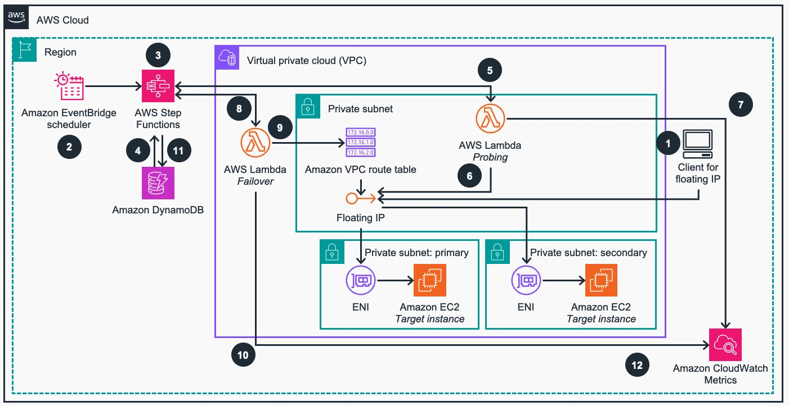

# Guidance for using Floating/virtual fixed IP address with Load Balancing on AWS 
This guidance demonstrates how to configure and automatically manage private, floating IP in a VPC to achieve high availability while maintaining single IP address.

## Table of Contents

### Required

1. [Overview](#overview)
    - [Architecture](#architecture)
    - [Cost](#cost)
3. [Prerequisites](#prerequisites)
    - [Operating System](#operating-system)
4. [Deployment Steps](#deployment-steps)
5. [Deployment Validation](#deployment-validation)
6. [Running the Guidance](#running-the-guidance)
7. [Cleanup](#cleanup)
8. [Notices](#notices)
9. [Authors](#authors)

## Overview

There are situations when there is a technical requirement for a static, single IP address to access an IT system from within the private network. Even though, each instance living in the network, like EC2, RDS, or FSx has its own, unique IP address, it gets challenging when high availability with Multi-AZ deployment is also required and no DNS based solution can be used. In this situation, Multi-AZ Network Load Balancer deployment, which provides multiple static IP addresses distributed across multiple AZs and single DNS, is not an option. 

Floating (or virtual) IP provides a solution to have one fixed IP and dynamically change target thus providing failover and other capabilities for those use cases.

### Use Cases

Primary Use Case for this guidance is a situation when an application or its architetcural components require static IP address for communication spanning multiple AWS AZs and/or hybrid environments. 
If possible, consider using AWS native services available before implementing this guidance, such as: Amazon Elastic Load Balancers and Amazon Route53 or Amazon Global Accelerator. AWS managed services provide high quality functionality without operational overhead required from you and should be prioritized before deploying custom code.

### Architecture

Below is the reference architecture of this guidance showing AWS services deployed and flow of interaction of client applications with system behing a Floating-IP.

The VPCs, subnets and the target EC2 Instances, representing business application, could be pre-existing ones or can be deployed as part of this guidance. For more information, please refer to the [Deployment Steps](#deployment-steps) below. 


**Figure 1. Reference Architecture for Floating/virtual fixed IP address with Load Balancing on AWS** 

**Architecture Workflow**

1. A client application connects to the target system through the floating IP address. 
2. [Amazon EventBridge](https://aws.amazon.com/eventbridge/) Scheduler invokes every minute the [AWS Step Functions](https://aws.amazon.com/step-functions/) flow which orchestrates the health checks and failover process of floating-IP, if needed.. 
3. AWS Step Functions flow execution iterates over set of steps every N seconds, where N is configurable, its execution runs up to one minute.
4. As an initial step, the context (probing counter and last probing result) from previous Step Function execution is retrieved from [Amazon DynamoDB](https://aws.amazon.com/pm/dynamodb/).
5. [AWS Lambda](https://aws.amazon.com/lambda/) probing function is invoked. The context from previous execution is passed as its input.
6. The Lambda probing function checks the health of the target of the floating IP address, which was initially set in the primary subnet and corresponding elastic network interface (ENI) attached to Amazon Elastic Compute Cloud (Amazon EC2). It then returns the probing result to the Step Functions implementation.
7. The Lambda probing function logs metrics like response time and failed probes in [Amazon CloudWatch](https://aws.amazon.com/cloudwatch/) Metrics
8. If the threshold of failed health checks is reached, the failover procedure is initialized by Step Functions flow. The failover  AWS Lambda function is invoked to execute the procedure.
9. The Lambda failover function updates one or more Amazon Virtual Private Cloud (Amazon VPC) route tables. It changes the target ENI attached to Amazon EC2 of the route associated with the floating IP address to the one set in a secondary subnet. 
10. The failover function logs failover count metrics in Amazon CloudWatch.
11. By the end of the AWS Step Functions execution, the context of the execution is stored in the Amazon DynamoDB database.
12. All relevant metrics stored in CloudWatch can be used to build comprehensive dashboards and create alarms for observability purposes. 


### AWS Services used in this Guidance

| **AWS service**  | Role | Description | Service Availability |
|-----------|------------|-------------|-------------|
|[Amazon EventBridge](https://aws.amazon.com/eventbridge/)| Core service | Rules and custom event buses are used for notifying and detecting new resources.| [Documentation](https://docs.aws.amazon.com/general/latest/gr/ev.html#ev_region) |
[AWS Step Functions](https://aws.amazon.com/step-functions/)| Core Service | Serverless state machine used for filtering, subscribing and updating information. | [Documentation](https://docs.aws.amazon.com/general/latest/gr/step-functions.html#ram_region) |
[AWS Systems Manager](https://aws.amazon.com/systems-manager/)| Support Service | Used to store parameters that will later be shared. | [Documentation](https://docs.aws.amazon.com/general/latest/gr/ssm.html#ssm_region) |
[AWS Resource Access Manager (RAM)](https://aws.amazon.com/ram/)| Support Service | Used to share parameters among accounts. | [Documentation](https://docs.aws.amazon.com/general/latest/gr/ram.html#ram_region) |
[Amazon Simple Queue Service (SQS)](https://aws.amazon.com/sqs/)| Support Service | Used to store unprocessed messages for troubleshooting. | [Documentation](https://docs.aws.amazon.com/general/latest/gr/sqs-service.html#ram_region)
|[AWS Lambda](https://aws.amazon.com/lambda/) | Core service | Lambda Function for event driven processing  | [Documentation](https://docs.aws.amazon.com/lambda/)|

### Cost 

You are responsible for the cost of the AWS services deployed while running this guidance. As of May 2025, the cost of running this Guidance with default settings lies within the Free Tier, except for the use of AWS Systems Manager Advanced Paramter storage.

We recommend creating a [budget](https://docs.aws.amazon.com/cost-management/latest/userguide/budgets-create.html) through [AWS Cost Explorer](http://aws.amazon.com/aws-cost-management/aws-cost-explorer/) to help manage costs. Prices are subject to change. You can also estimate the cost for your architecture solution using [AWS Pricing Calculator](https://calculator.aws/#/). For full details, refer to the pricing webpage for each AWS service used in this Guidance or visit [Pricing by AWS Service](#pricing-by-aws-service).

**Estimated monthly cost breakdown - Networking Account**

This breakdown of the costs of the Networking Account shows that the highest cost of the implementation is the [Advanced Parameter Storage](https://docs.aws.amazon.com/systems-manager/latest/userguide/parameter-store-advanced-parameters.html) resource from [AWS Systems Manager](https://aws.amazon.com/systems-manager/) service. 
The costs are estimated for US East 1 (Virginia) `us-east-1` region for one month.

| **AWS service**  | Dimensions | Cost, month \[USD\] |
|-----------|------------|------------|
| AWS Systems Manager | 1 advanced parameter | \$ 0.05 |
| Amazon EventBridge  | <= 1 million custom events | \$ 1.00 |
| AWS Step Functions  | < 4,000 state transitions | \$ 0.00 |
| Amazon SQS          | < 1 million requests/month | \$ 0.00 |
| **TOTAL estimate** |  | **\$ 1.05/month** |

**Estimated monthly cost breakdown - Spoke Accounts**

The following table provides a sample cost breakdown for deploying this Guidance in 1,000 different spoke Accounts (which are likely to provide a VPC Lattice service in the future). The costs are estimated in the Ireland `eu-west-1` region for one month.

| **AWS service**  | Dimensions | Cost, month \[USD\] |
|-----------|------------|------------|
| Amazon EventBridge  | <= 1 million custom events | \$ 1.00 |
| AWS Step Functions  | < 4,000 state transitions | \$ 0.00 |
| Amazon SQS          | <= 1 million requests/month | \$ 0.00 |
| **TOTAL estimate** |  | **\$ 1.00/month** |

Please see price breakdown details in this [AWS calculator](https://calculator.aws/#)


## Prerequisites

### Operating System

This Guidance uses [AWS Serverless](https://aws.amazon.com/serverless/) managed services, so there's no OS patching or management required.

### Network
- VPC where the guidance infrastructure is deployed has Internet access or VPC Endpoints to Cloudwatch and monitoring. Endpoints can be accessed by probing and Failover Lambda functions.
- Target instances should have security groups configured in a way, that the probing lambda can access them(e.g. source and port are open for the Lambda's ENI)

By deploying the `VpcStack`, which is an optional [part one](#part-1-deploy-the-basic-infrastructure-if-not-available) of this guidance, the prerequisites can be deployed as well.

### Operating System
This guidance requires, that the floating-ip is known to the operating system and configured for the network adapter on the target instances. By default, AMIs for AL2(Amazon Linux 2), configure only the IP addresses provided during instantiation of the instance. 

**Example:**
These deployment instructions are optimized to best work on **<Amazon Linux 2 AMI>**.  Deployment in another OS may require additional steps. To configure the floating IP address on existing AL2 instance follow the steps. You might need root permissions:
1. Navigate to /etc/sysconfig/network-scripts/
2. Create new file called `eth0:0` for eth0 ENI(Elastic Network Interface)
3. Copy and paste the content of the [example  file](deployment/vpc/eth0:0)
```bash
DEVICE=eth0:0
BOOTPROTO=static
ONBOOT=yes
PREFIX=32
IPADDR=20.0.0.10
```
4. Change the IP address `IPADDR` to the desired floating IP(here 20.0.0.10)
5. Restart the networking service:  `service network restart`
6. Validate the IP `ip addr show eth0`. The additional IP address should be visible.

<!--
### Third-party tools (If applicable)

*List any installable third-party tools required for deployment.*

### AWS account requirements (If applicable)

This deployment requires that the CDK is installed and configured in AWS Account.

*List out pre-requisites required on the AWS account if applicable, this includes enabling AWS regions, requiring ACM certificate.*
-->

### Security

When you build systems on AWS infrastructure, security responsibilities are shared between you and AWS. This [shared responsibility model](https://aws.amazon.com/compliance/shared-responsibility-model/) reduces your operational burden because AWS operates, manages, and controls the components including the host operating system, the virtualization layer, and the physical security of the facilities in which the services operate. For more information about AWS security visit [AWS Cloud Security](http://aws.amazon.com/security/).

This guidance relies on many reasonable default options and "principle of least privilege" access for all resources. Users that deploy it in production should go through all the deployed resources and ensure those defaults comply with their security requirements and policies, have adequate logging levels and alarms enabled, and protect access to publicly exposed APIs. IAM roles are defined for Lambda to only access the corresponding resources such as EventBridge, Amazon SQS, and Amazon SNS. AWS RAM securely shares resource parameter such as SQS queue ARN and EventBridge custom event bus ARN. 

**NOTE**: Please note that by cloning and using third party open-source code, you assume responsibility for its patching, securing, and managing in the context of this project.

### Supported Regions (if applicable)

<!-- If the Guidance is built for specific AWS Regions, or if the services used in the Guidance do not support all Regions, please specify the Region this Guidance is best suited for -->
Guidance for using Floating/virtual fixed IP address with Load Balancing is supported in the following AWS Regions:

| **Region Name**  | **Region Code**| 
|-----------|------------|
|US East (Ohio) | AWS GovCloud (US-West)|
|US East (N. Virginia) | AWS GovCloud (US-East) |
|US West (Northern California) | Middle East (Bahrain) |
|US West (Oregon) | Middle East (UAE) |
|Canada (Central)  | Israel (Tel Aviv) |
|South America (São Paulo)  | Africa (Cape Town) |
|EU (Frankfurt)  | Asia Pacific (Singapore) |
|EU (Stockholm) | Asia Pacific (Sydney) |
|EU (Ireland)  | Asia Pacific (Jakarta) |
|EU (Milan) | Asia Pacific (Tokyo) |
|EU (Spain)  | Asia Pacific ( Seoul ) |
|EU (London) | Asia Pacific (Osaka) |
|Europe (Paris)  | Asia Pacific (Mumbai) |


## Deployment Steps

Deployment of this guidence is split into two parts of which both or just the second one might be applicable for your use case:
- The first part comprises of basic AWS infrastructure, applicable if you just want to deploy and test the guidance in your test AWS environment. It deploys networking with VPC, subnets and corresponding route tables as well as EC2 instances and mimics the client and target applications. 
- The second part is the actual guidance. Depending on your use case, both or just this part can be deployed. If there is a basic infrastructure aready in place, and the clients/target application are deployed and available, then only this part needs to be deployed.

### Prepare the client machine:
1. Install AWS CLI and configure it. See the [documentation](https://docs.aws.amazon.com/cli/latest/userguide/getting-started-quickstart.html) for further informations. The commandes assume, the default profile is used. 
2. Install AWS CDK. See the [documentation](https://docs.aws.amazon.com/cdk/v2/guide/getting-started.html).
3. Install TypeScript. See [documentation](https://www.typescriptlang.org/download/) for further information.
4. Clone the repo of the guidance using command 
```bash
git clone https://github.com/aws-solutions-library-samples/guidance-for-using-floating-virtual-fixed-ip-address-with-load-balancing-on-aws.git
``` 
5. Navigate into the cloned repository:
```bash
cd guidance-for-using-floating-virtual-fixed-ip-address-with-load-balancing-on-aws
```
6. Download the node.js dependencies using command:
```bash
npm install
```
7. Compile TypeScript code and watch for watches using command:
```bash
tcs
```
### (Part 1) Deploy the basic infrastructure (if not available):
8. Deploy part one (basic infrastructure) using command:
```bash
cdk deploy VpcStack --require-approval never --method=direct
```
 Wait until the deployment finishes. It should take about 3-4 minutes. At the end of deployment, outputs are shown.
 
9. Execute the helper script with command:
```bash
sh prepare-cdk-json.sh default
``` 
to automatically prepare contents of `cdk.json` configuration file for AWS CDK deployment based on the instracture deployed in previous step. 
The contents of `cdk.json` can be prepared manually: Look for the Output from previous step, and replace placeholders `ENTER-VALUE` in the file with appropriate values from that ouput.

### (Part 2) Deploy the guidance:

10. Configure `cdk.json`. Replace `ENTER-VALUE` placeholders with actual values - those values come from preexisting infrastructure. If the part one(basic infrastructure) of this deployment was executed, this file is already configured with proper parameter values and ready to be used.
11. Deploy the guidance using command:
```bash
cdk deploy ApplicationStack --require-approval never --method=direct
```
It should take about 4-5 minutes to complete

## Deployment Validation

After the guidance deployment is completed, it can be validated either in AWS Console or via AWS CLI. 
Below are instructions on how to validate guidance deployment via AWS Console:
1. Log into the AWS Account
2. Open [CloudFormation console](https://console.aws.amazon.com/cloudformation/) and verify the status of the Stack with the name `ApplictationStack`. It should be green and have Status `CREATE_COMPLETE`
3. Open [StepFunctions console](https://console.aws.amazon.com/states), look for state machine called `FloatingIP-StateMachine` and open it. There should be some executions alredy in Status either `Succeeded` or still `Running`.
4. Open [VPC route tables console](http://console.aws.amazon.com/vpcconsole/home?#RouteTables), look for one of the Route tables belonging to client subnets(client_subnet_ids from `cdk.json` file). There should be a route, where the IP(`floating_ip` value from `cdk.json` file) targets an ENI (`target_eni_primary` from `cdk.json` file).
If the Part one (see above) was deployed, there should be route for `IP = 20.0.0.1`


## Running the Guidance

Since the guidance is satisfying a specific technical requirement for a static, single IP address to access an IT system from within the private network, it can be used by a client application that needs to access a AWS resource(s) using such floating virtual IP address in that network as an endpoint. 

## Cleanup
To remove the guidance and the related AWS srvices,  please follow the steps below:
1. Remove the `ApplicationStack` Cloud Fomation stack using command:

```bash
cdk destroy ApplicationStack
``` 
Confirm the removal of the ApplicationStack. 

2. Remove the `VpcStack` Cloud Fomation stack using command:
```bash
cdk destroy VpcStack
```
 Confirm the removal of the stack. This is needed if the `VpcStack` was deployed as part of this guidance. 
3. Ensure that the Stacks were destroyed successfully. Navidate to [CloudFormation console](https://console.aws.amazon.com/cloudformation/) and verify that there is no Stacks named `VpcStack` or `ApplicationStack`

## License

This library is licensed under the MIT-0 License. See the [LICENSE](LICENSE) file.

## Contributing

See [CONTRIBUTING](CONTRIBUTING.md) for more information.

## Notices

*Customers are responsible for making their own independent assessment of the information in this Guidance. This Guidance: (a) is for informational purposes only, (b) represents AWS current product offerings and practices, which are subject to change without notice, and (c) does not create any commitments or assurances from AWS and its affiliates, suppliers or licensors. AWS products or services are provided “as is” without warranties, representations, or conditions of any kind, whether express or implied. AWS responsibilities and liabilities to its customers are controlled by AWS agreements, and this Guidance is not part of, nor does it modify, any agreement between AWS and its customers.*


## Authors

Daniel Zilberman, Sr WW Specialist SA, AWS Tech Solutions <br/>
Michal Kolodziej, Sr. WW Specialist SA, Networking
