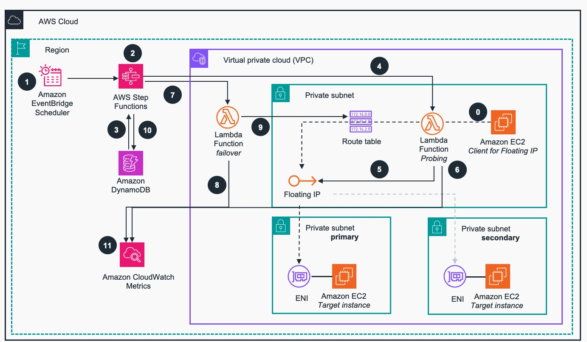

# Guidance for using Floating/virtual fixed IP address with Load Balancing on AWS 
This guidance demonstrates how to configure and automatically manage private, floating IP in a VPC to achieve high availability while maintaining single IP address.

## Table of Contents

### Required

1. [Overview](#overview)
    - [Architecture](#architecture)
    - [Cost](#cost)
3. [Prerequisites](#prerequisites)
    - [Operating System](#operating-system)
4. [Deployment Steps](#deployment-steps)
5. [Deployment Validation](#deployment-validation)
6. [Running the Guidance](#running-the-guidance)
7. [Next Steps](#next-steps)
8. [Cleanup](#cleanup)

***Optional***

8. [FAQ, known issues, additional considerations, and limitations](#faq-known-issues-additional-considerations-and-limitations-optional)
9. [Revisions](#revisions-optional)
10. [Notices](#notices-optional)
11. [Authors](#authors-optional)

## Overview

There are situations when there is a technical requirement for a static, single IP address to reach an IT system from within the private network. Even though, each instance living in the network, like EC2, RDS, or FSx has its own, unique IP address, it gets challenging when high availability with Multi-AZ deployment is also required and no DNS can be used. In this situation, Multi-AZ Network Load Balancer deployment, which provides multiple static IP addresses distributed across multiple AZs and single DNS, is not an option. 

Floating (or virtual) IP provides a solution to have one fixed IP and dynamically change target providing e.g. failover capabilities

### Use cases

**TO DO - add specific use case description here**

### Architecture

Below is the reference architecture of this guidance showing AWS services deployed and flow of interaction of client applications with system behing a Floating-IP.

The VPCs, subnets and the target EC2 Instances, representing business application, could be pre-existing ones or can be deployed as part of this guidance. For more information, please refer to the [Deployment Steps](#deployment-steps) below. 


**Figure 1. Reference Architecture for Floating/virtual fixed IP address with Load Balancing on AWS ** 

**Architecture Workflow**

0. The client application (e.g. running on [Amazon EC2](https://aws.amazon.com/pm/ec2/) ) connects to the target cloud resource through floating-IP. It represents the business application.
1. [Amazon EventBridge](https://aws.amazon.com/eventbridge/) Scheduler invokes every minute the [AWS Step Functions](https://aws.amazon.com/step-functions/) flow which orchestrates the health checks and failover process of floating-IP, if needed.. 
2. AWS Step Functions flow execution iterates over set of steps every N seconds, where N is configurable. One execution runs up to a minute.
3. As an initial step, the context (probing counter and last probing result) from previous Step Function execution is retrieved from [Amazon DynamoDB](https://aws.amazon.com/pm/dynamodb/).
4. AWS Lambda probing function is invoked. The context from previous execution is passed as its input.
5. The probing AWS Lambda function checks the health of the target of the floating-IP, returns the probing result back to AWS Step Functions execution. In case of failed health check, it increases the count of failed health checks by one and sets the probing result to ”failed”. 
6. The probing function logs metrics like response time and failed probes in [Amazon CloudWatch](https://aws.amazon.com/cloudwatch/) Metrics
7. If the threshold of failed health checks is reached, the failover procedure is initialized by Step Functions flow. The failover  AWS Lambda function is invoked to execute the procedure.
8. The failover AWS Lambda function manipulates one or more Route Tables, and changes the target ENI (Elastic Network Interface) of the route associated with the floating-IP to the one in "secondary" subnet
9. The failover function logs failover count metrics in Amazon CloudWatch Metrics.
10. By the end of the AWS Step Functions execution, the context of the execution is stored in the Amazon DynamoDB.
11. All metrics in Amazon CloudWatch could be used to build monitoring dashboards or set alarms in CloudWatch.


 


 


### AWS Services used in this Guidance

| **AWS service**  | Role | Description | Service Availability |
|-----------|------------|-------------|-------------|
|[Amazon EventBridge](https://aws.amazon.com/eventbridge/)| Core service | Rules and custom event buses are used for notifying and detecting new resources.| [Documentation](https://docs.aws.amazon.com/general/latest/gr/ev.html#ev_region) |
[AWS Step Functions](https://aws.amazon.com/step-functions/)| Core Service | Serverless state machine used for filtering, subscribing and updating information. | [Documentation](https://docs.aws.amazon.com/general/latest/gr/step-functions.html#ram_region) |
[AWS Systems Manager](https://aws.amazon.com/systems-manager/)| Support Service | Used to store parameters that will later be shared. | [Documentation](https://docs.aws.amazon.com/general/latest/gr/ssm.html#ssm_region) |
[AWS Resource Access Manager (RAM)](https://aws.amazon.com/ram/)| Support Service | Used to share parameters among accounts. | [Documentation](https://docs.aws.amazon.com/general/latest/gr/ram.html#ram_region) |
[Amazon Simple Queue Service (SQS)](https://aws.amazon.com/sqs/)| Support Service | Used to store unprocessed messages for troubleshooting. | [Documentation](https://docs.aws.amazon.com/general/latest/gr/sqs-service.html#ram_region)
|[AWS Lambda](https://aws.amazon.com/lambda/) | Core service | Lambda Function for event driven processing  | [Documentation](https://docs.aws.amazon.com/lambda/)|

### Cost 

You are responsible for the cost of the AWS services deployed while running this guidance. As of November 2024, the cost of running this Guidance with default settings lies within the Free Tier, except for the use of AWS Systems Manager Advanced Paramter storage.

We recommend creating a [budget](https://docs.aws.amazon.com/cost-management/latest/userguide/budgets-create.html) through [AWS Cost Explorer](http://aws.amazon.com/aws-cost-management/aws-cost-explorer/) to help manage costs. Prices are subject to change. You can also estimate the cost for your architecture solution using [AWS Pricing Calculator](https://calculator.aws/#/). For full details, refer to the pricing webpage for each AWS service used in this Guidance or visit [Pricing by AWS Service](#pricing-by-aws-service).

**Estimated monthly cost breakdown - Networking Account**

This breakdown of the costs of the Networking Account shows that the highest cost of the implementation is the [Advanced Parameter Storage](https://docs.aws.amazon.com/systems-manager/latest/userguide/parameter-store-advanced-parameters.html) resource from AWS Systems Manager service. The costs are estimated for US East 1 (Virginia) `us-east-1` region for one month.

| **AWS service**  | Dimensions | Cost, month \[USD\] |
|-----------|------------|------------|
| AWS Systems Manager | 1 advanced parameter | \$ 0.05 |
| Amazon EventBridge  | <= 1 million custom events | \$ 1.00 |
| AWS Step Functions  | < 4,000 state transitions | \$ 0.00 |
| Amazon SQS          | < 1 million requests/month | \$ 0.00 |
| **TOTAL estimate** |  | **\$ 1.05/month** |

**Estimated monthly cost breakdown - Spoke Accounts**

The following table provides a sample cost breakdown for deploying this Guidance in 1,000 different spoke Accounts which are likely to provide a VPC Lattice service in the future. The costs are estimated in the Ireland `eu-west-1` region for one month.

| **AWS service**  | Dimensions | Cost, month \[USD\] |
|-----------|------------|------------|
| Amazon EventBridge  | <= 1 million custom events | \$ 1.00 |
| AWS Step Functions  | < 4,000 state transitions | \$ 0.00 |
| Amazon SQS          | <= 1 million requests/month | \$ 0.00 |
| **TOTAL estimate** |  | **\$ 1.00/month** |

Please see price breakdown details in this [AWS calculator](https://calculator.aws/#/estimate?id=6ee067550372e1563469fded6e9f69d665113897)

**Pricing by AWS Service**

Bellow are the pricing references for each AWS Service used in this Guidance.

| **AWS service**  |  Pricing  |
|-----------|---------------|
|[Amazon EventBridge](https://aws.amazon.com/eventbridge/)| [Documentation](https://aws.amazon.com/eventbridge/pricing/) |
[AWS Step Functions](https://aws.amazon.com/step-functions/)|  [Documentation](https://aws.amazon.com/step-functions/pricing/) |
[AWS Systems Manager](https://aws.amazon.com/systems-manager/)|  [Documentation](https://aws.amazon.com/systems-manager/pricing/) |
[Amazon Simple Queue Service (SQS)](https://aws.amazon.com/sqs/)| [Documentation](https://aws.amazon.com/sqs/pricing/)

## Prerequisites

### Operating System

This Guidance uses [AWS Serverless](https://aws.amazon.com/serverless/) managed services, so there's no OS patching or management.

### Network
- VPC with Internet access or VPC Endpoints to Cloudwatch and monitoring. Endpoints can be accessed by probing and Failover Lambda functions.
- Target instances should have security groups configured in a way, that the probing lambda can access them(e.g. source and port are open for the Lambda's ENI)

By deploying the VpcStack, which is an optional part of this guidance, the prerequisites can be deployed as well.

### Operating System
This guidance requires, that the floating-ip is known to the operating system and configured for the network adapter. By default, AMIs like for AL2(Amazon Linux 2), configure only the IP addresses privided during instantiation of the instance. 

**Example:**
These deployment instructions are optimized to best work on **<Amazon Linux 2 AMI>**.  Deployment in another OS may require additional steps. To configure the floating IP address on existing AL2 instance follow the steps. You might need root permissions:
1. Navigate to /etc/sysconfig/network-scripts/
2. Create new file called `eth0:0` for eth0 ENI(Elastic Network Interface)
3. Copy and paste the content of the [example  file](deployment/vpc/eth0:0)
```
DEVICE=eth0:0
BOOTPROTO=static
ONBOOT=yes
PREFIX=32
IPADDR=20.0.0.10
```
4. Change the IP address `IPADDR` to the desired floating IP(here 20.0.0.10)
5. Restart the networking service:  `service network restart`
6. Validate the IP `ip addr show eth0`. The additional IP address should be visible.

### Third-party tools (If applicable)

*List any installable third-party tools required for deployment.*


### AWS account requirements (If applicable)

*List out pre-requisites required on the AWS account if applicable, this includes enabling AWS regions, requiring ACM certificate.*
<!--
**Example:** “This deployment requires you have public ACM certificate available in your AWS account”

**Example resources:**
- ACM certificate 
- DNS record
- S3 bucket
- VPC
- IAM role with specific permissions
- Enabling a Region or service etc.


### aws cdk bootstrap (if sample code has aws-cdk)

<If using aws-cdk, include steps for account bootstrap for new cdk users.>

**Example blurb:** “This Guidance uses aws-cdk. If you are using aws-cdk for first time, please perform the below bootstrapping....”
-->

### Security

When you build systems on AWS infrastructure, security responsibilities are shared between you and AWS. This [shared responsibility model](https://aws.amazon.com/compliance/shared-responsibility-model/) reduces your operational burden because AWS operates, manages, and controls the components including the host operating system, the virtualization layer, and the physical security of the facilities in which the services operate. For more information about AWS security visit [AWS Cloud Security](http://aws.amazon.com/security/).

This guidance relies on many reasonable default options and "principle of least privilege" access for all resources. Users that deploy it in production should go through all the deployed resources and ensure those defaults comply with their security requirements and policies, have adequate logging levels and alarms enabled, and protect access to publicly exposed APIs. IAM roles are defined for Lambda to only access the corresponding resources such as EventBridge, Amazon SQS, and Amazon SNS. AWS RAM securely shares resource parameter such as SQS queue ARN and EventBridge custom event bus ARN. 

**NOTE**: Please note that by cloning and using third party open-source code, you assume responsibility for its patching, securing, and managing in the context of this project.

### Service limits  (if applicable)

<Talk about any critical service limits that affect the regular functioning of the Guidance. If the Guidance requires service limit increase, include the service name, limit name and link to the service quotas page.>

### Supported Regions (if applicable)

<If the Guidance is built for specific AWS Regions, or if the services used in the Guidance do not support all Regions, please specify the Region this Guidance is best suited for>


## Deployment Steps

Deployment steps must be numbered, comprehensive, and usable to customers at any level of AWS expertise. The steps must include the precise commands to run, and describe the action it performs.

* All steps must be numbered.
* If the step requires manual actions from the AWS console, include a screenshot if possible.
* The steps must start with the following command to clone the repo. ```git clone xxxxxxx```
* If applicable, provide instructions to create the Python virtual environment, and installing the packages using ```requirement.txt```.
* If applicable, provide instructions to capture the deployed resource ARN or ID using the CLI command (recommended), or console action.

<!-- 
**Example:**

1. Clone the repo using command ```git clone xxxxxxxxxx```
2. cd to the repo folder ```cd <repo-name>```
3. Install packages in requirements using command ```pip install requirement.txt```
4. Edit content of **file-name** and replace **s3-bucket** with the bucket name in your account.
5. Run this command to deploy the stack ```cdk deploy``` 
6. Capture the domain name created by running this CLI command ```aws apigateway ............```
-->

Deployment Steps are below:

1. Navigate to /etc/sysconfig/network-scripts/
2. Create new file called `eth0:0` for eth0 ENI(Elastic Network Interface)
3. Copy and paste the content of the [example  file](deployment/vpc/eth0:0)
```bash
DEVICE=eth0:0
BOOTPROTO=static
ONBOOT=yes
PREFIX=32
IPADDR=20.0.0.10
```
4. Change the IP address `IPADDR` to the desired floating IP(here 20.0.0.10)
5. Restart the networking service:  `service network restart`
6. Validate the IP `ip addr show eth0`. The additional IP address should be visible.


## Deployment Validation

<Provide steps to validate a successful deployment, such as terminal output, verifying that the resource is created, status of the CloudFormation template, etc.>


**Examples:**

* Open CloudFormation console and verify the status of the template with the name starting with xxxxxx.
* If deployment is successful, you should see an active database instance with the name starting with <xxxxx> in        the RDS console.
*  Run the following CLI command to validate the deployment: ```aws cloudformation describe xxxxxxxxxxxxx```


## Running the Guidance

<Provide instructions to run the Guidance with the sample data or input provided, and interpret the output received.> 

This section should include:

* Guidance inputs
* Commands to run
* Expected output (provide screenshot if possible)
* Output description


## Next Steps

Provide suggestions and recommendations about how customers can modify the parameters and the components of the Guidance to further enhance it according to their requirements.


## Cleanup

- Include detailed instructions, commands, and console actions to delete the deployed Guidance.
- If the Guidance requires manual deletion of resources, such as the content of an S3 bucket, please specify.


## FAQ, known issues, additional considerations, and limitations (optional)


**Known issues (optional)**

<If there are common known issues, or errors that can occur during the Guidance deployment, describe the issue and resolution steps here>


**Additional considerations (if applicable)**

<Include considerations the customer must know while using the Guidance, such as anti-patterns, or billing considerations.>

**Examples:**

- “This Guidance creates a public AWS bucket required for the use-case.”
- “This Guidance created an Amazon SageMaker notebook that is billed per hour irrespective of usage.”
- “This Guidance creates unauthenticated public API endpoints.”


Provide a link to the *GitHub issues page* for users to provide feedback.


**Example:** *“For any feedback, questions, or suggestions, please use the issues tab under this repo.”*

## Revisions (optional)

Document all notable changes to this project.

Consider formatting this section based on Keep a Changelog, and adhering to Semantic Versioning.

## License

This library is licensed under the MIT-0 License. See the [LICENSE](LICENSE) file.

## Contributing

See [CONTRIBUTING](CONTRIBUTING.md) for more information.

## Notices


*Customers are responsible for making their own independent assessment of the information in this Guidance. This Guidance: (a) is for informational purposes only, (b) represents AWS current product offerings and practices, which are subject to change without notice, and (c) does not create any commitments or assurances from AWS and its affiliates, suppliers or licensors. AWS products or services are provided “as is” without warranties, representations, or conditions of any kind, whether express or implied. AWS responsibilities and liabilities to its customers are controlled by AWS agreements, and this Guidance is not part of, nor does it modify, any agreement between AWS and its customers.*


## Authors

Daniel Zilberman, Sr SA AWS Tech Solutions <br/>
Michal Kolodziej, Sr. WW Specialist SA Networking
